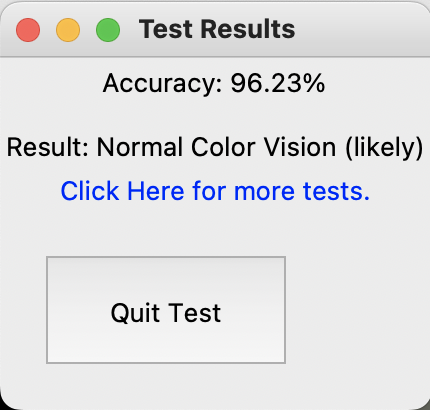

# Color Blindness Chatbot

## Overview
The Color Blindness Chatbot is an educational tool designed to assist users in understanding various aspects of color vision deficiency. This README provides instructions on setting up, running, and using the chatbot system.

## Solution Outline

User Interaction: The chatbot provides a graphical user interface (GUI) for users to input queries related to color blindness.

Message Processing: Upon receiving user input, the chatbot processes messages to identify keywords related to color blindness topics.

Response Generation: Based on identified keywords, the chatbot generates informative responses about color blindness types, causes, impacts, treatments, and more.

Language Translation: Supports English, Hindi, and Telugu languages with automatic translation of user inputs and responses.

Voice Generation: The chatbot can dictate responses to users.

Additional Functionalities: Users can initiate a color blindness test or request color identification via dedicated buttons in the GUI.

## Examples

Input: User asks, "What is color blindness?"

Output: The chatbot responds with information about color blindness in the user's preferred language.

Input: User requests a color blindness test.

Output: The chatbot launches a color blindness test interface, allowing the user to assess their color vision.

  Test Result:
  

Input: User requests to identify a color.

Output: The chatbot launches a color identification interface, where users can interactively identify colors.

## Setup and Execution

#### Prerequisites: 
Ensure Python 3.11 is installed on your system.

#### Dependencies: 
Install required Python libraries listed in requirements.txt.

#### Scripts: Download the following Python scripts:

  chatbot.py: Main script for the color blindness chatbot.
  test.py: Script for conducting the color blindness test.
  identify_c.py: Script for identifying colors.
  
#### Execution: Run the chatbot using Python:
python chatbot.py

#### GUI Interaction:
Use the graphical interface to interact with the chatbot, ask questions, and utilize additional features.

#### Recompilation and Rerunning: 
To recompile and rerun the system, ensure all dependencies are installed and scripts are correctly downloaded.

# Dataset Link
https://github.com/bhav09/Color_Blindness_Toolkit/tree/master/dataset
